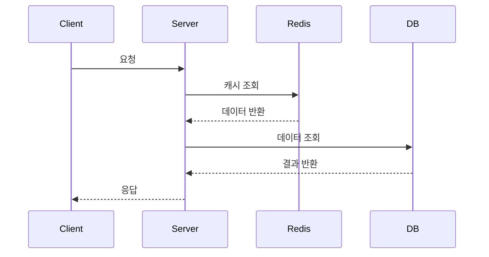
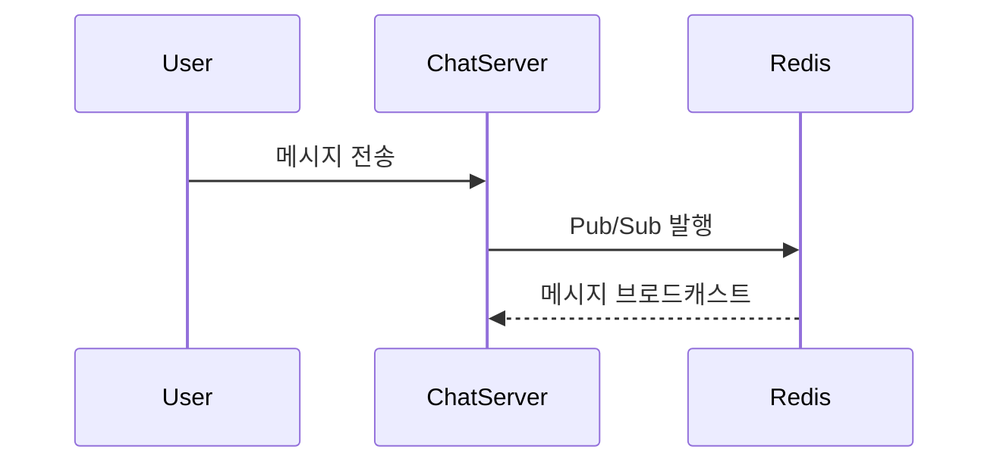

# 🖥️ 채팅 서버

<br>

---

# 1. 📌 서버 개요

## 서버 소개

 채팅 서버는 멀티벤더 마켓플레이스 플랫폼의 채팅 기능을 담당하는 서버입니다. 
 구매자와 판매자 간 WebSocket 기반 실시간 채팅과, 반품·교환 정책 문서를 기반으로 고객 질문에 답변하는 RAG 기반 AI 고객 어시스턴트를 제공합니다.

<br>

---

# 2. 📡 주요 API

| Method | URI              | Description       |
|--------|------------------|-------------------|
| POST   | /chat/stream     | 챗봇 대화 API         |
| POST   | /chat/rooms      | 채팅방 생성 API        |
| GET    | /chat/rooms | 채팅방 목록 조회 API     |
| GET    | /chat/rooms/{roomId}/messages | 채팅 내역 조회(스크롤) API |

<br>

---

# 3. 🔄 서비스 플로우

## 기능 플로우



<br>

## 실시간 처리 플로우



<br>

---

# 4. 🗂️ ERD

```md

```

<br>

---

# 5. 🧠 기술적 의사 결정

## WebSocket + Redis Pub/Sub 활용

### 배경

멀티 벤더 이커머스 환경에서 구매자와 판매자 간 실시간 채팅 기능이 필요했다.

### 기술 선택지

실시간 통신 방식은 크게 HTTP Polling, SSE(Server-Sent Events), WebSocket으로 나뉜다. 
우리는 WebSocket + STOMP 방식을 선택했다.
멀티 서버 환경의 메시지 브로커로는 Spring SimpleBroker와 Redis Pub/Sub 중 Redis Pub/Sub을 선택했다.

### 선택 이유

HTTP Polling은 불필요한 반복 요청이 발생하고, SSE는 서버→클라이언트 단방향 통신만 가능하다. 
WebSocket은 한 번 연결 후 양방향 통신이 유지되어 낮은 지연 시간과 실시간 Push가 가능해 채팅 구조에 적합하다.

Spring SimpleBroker는 세션을 서버 메모리에서만 관리하기 때문에, 
ECS Fargate 기반 수평 확장 환경에서 서버 A에 연결된 사용자의 메시지가 서버 B에 연결된 사용자에게 전달되지 않는 문제가 발생한다. 
Redis Pub/Sub을 중앙 브로커로 두면 어느 서버에서 메시지를 발행하더라도 모든 인스턴스가 수신하고 자신의 세션에 연결된 클라이언트에게만 전달할 수 있어, 멀티 서버 환경의 메시지 동기화 문제를 구조적으로 해결할 수 있다.

### 해결 및 결과

WebSocket 도입으로 실시간 양방향 채팅 기능을 구현했고, Redis Pub/Sub 도입으로 멀티 서버 환경에서의 메시지 동기화 문제를 해결하며 ECS Fargate 기반 수평 확장이 가능한 구조를 갖췄다. 
ACK 응답과 읽지 않은 메시지(unread) 처리, Redis 기반 메시지 브로드캐스트를 구현해 실제 서비스 수준의 실시간 채팅 구조를 완성했다.

<br>

---

## 도메인 특화 Narrow RAG 전략 채택

### 배경

멀티벤더 마켓플레이스의 고객 문의 챗봇을 구축하는 상황에서, 교환/환불/배송 등 정책 관련 질문에 정확한 답변을 제공해야 했다.

### 기술 선택지

RAG 구축 전략은 크게 두 가지다. 
위키, 뉴스, 블로그 등 광범위한 데이터를 학습하는 Wide & Diverse RAG와, 검증된 도메인 문서만을 지식 베이스로 사용하는 Narrow & Specialized RAG다. 
우리는 Narrow & Specialized RAG를 선택했다.

### 선택 이유

Wide RAG는 다양한 질문에 답할 수 있지만, 정책처럼 정확성이 중요한 도메인에서는 환각(Hallucination) 위험이 높고 출처 검증이 어렵다. 
반면 검증된 정책 문서만을 사용하면 답변의 출처가 명확해지고, 법적 분쟁 소지를 구조적으로 차단할 수 있다.

### 해결 및 결과

지식 베이스를 정책 문서로 한정함으로써 LLM이 학습 지식으로 추측하는 상황 자체를 제거했다. 
정책에 없는 질문은 답변하지 않는 명확한 경계가 생겨 답변 일관성과 신뢰도가 높아졌다.

<br>

---

## 하이브리드 검색과 RRF 알고리즘으로 검색 품질 고도화

### 배경

RAG 파이프라인에서 사용자 질문과 관련된 청크를 검색하는 단계가 필요했다.

### 기술 선택지

문서 검색 방식은 크게 의미 기반의 벡터 검색, 정확한 단어 매칭 기반의 키워드 검색, 그리고 두 방식을 통합하는 하이브리드 검색으로 나뉜다. 
우리는 하이브리드 검색 + RRF 알고리즘을 선택했다

### 선택 이유

벡터 검색만 사용하면 의미적으로 유사하지만 실제로는 관련 없는 청크가 결과에 포함되고, 키워드 검색만 사용하면 동의어나 문맥을 놓친다. 
Cormack et al. (2009) 논문(SIGIR 2009)에서 검증된 RRF 알고리즘은 두 검색 방식의 순위를 통합해 각각의 단점을 상호 보완한다.

### 해결 및 결과

학술적으로 검증된 RRF 알고리즘을 직접 구현해 두 검색 방식의 장점을 결합했고, 이를 통해 검색 정밀도를 높여 LLM에 전달되는 컨텍스트 품질을 개선했다.

<br>

---

## Java 21 Virtual Thread로 동시성 처리 최적화

### 배경

RAG 파이프라인은 벡터 검색, 키워드 검색, LLM 호출 등 여러 I/O 집약적 작업이 순차적으로 또는 병렬로 실행된다.

### 기술 선택지

Java의 동시성 처리 방식은 크게 고정된 스레드 수를 재사용하는 ThreadPool 방식과, Java 21에서 정식 도입된 Virtual Thread 방식으로 나뉜다. 
우리는 Java 21 Virtual Thread를 선택했다.

### 선택 이유

ThreadPool은 maxPoolSize가 고정되어 있어 동시 요청이 한계를 초과하면 이후 요청이 대기 상태에 빠진다. 
Virtual Thread는 OS 스레드와 1:1로 매핑되지 않아 생성 비용이 낮고, I/O 대기 중에는 carrier thread를 반납해 다른 작업이 실행될 수 있다. 
RAG처럼 I/O 비중이 높은 워크로드에 구조적으로 적합하다.

### 해결 및 결과

Virtual Thread 도입으로 동시성 제한을 제거했고, SecurityContext 전파 문제를 직접 해결하는 과정에서 Virtual Thread의 동작 방식을 깊이 이해하게 됐다. 
I/O 집약적 워크로드에서 ThreadPool을 대체하는 적합한 선택이었다.

<br>

---

## Semantic Chunking으로 의미 단위 문서 분할

### 배경

정책 문서를 벡터 DB에 저장하기 위해 청킹(분할) 작업이 필요했다.

### 기술 선택지

문서 청킹 방식은 크게 토큰 수나 문자 수 기준으로 기계적으로 자르는 고정 크기 청킹과, 문장 간 의미적 유사도를 기준으로 자르는 Semantic Chunking으로 나뉜다. 
우리는 Semantic Chunking을 선택했다.

### 선택 이유

고정 크기 청킹은 문서의 의미 구조를 무시하고 자르기 때문에, 하나의 정책 항목이 두 청크에 걸쳐 분리되는 문제가 발생한다. 
Reimers & Gurevych (2019) 논문(EMNLP 2019)에서 제안한 임베딩 유사도 기반 분할은 인접 문장 간 의미 연속성을 판단해 자연스러운 경계에서만 분할한다.

### 해결 및 결과

의미 단위 분할을 통해 청크의 완결성을 확보했고, 검색 시 불완전한 컨텍스트가 전달되는 문제를 구조적으로 해결했다. 
청킹 전략 하나가 검색 품질 전체에 미치는 영향을 직접 확인했다.

<br>

---

## Adaptive RAG로 질문 유형별 처리 전략 분기

### 배경

챗봇에 들어오는 질문은 정책 관련 질문만이 아니다. "안녕하세요", "감사합니다" 같은 일상적인 인사도 포함된다.

### 기술 선택지

질문 처리 방식은 모든 질문에 동일하게 RAG 파이프라인을 적용하는 단일 전략과, 질문 유형을 먼저 분류한 뒤 처리 방식을 나누는 Adaptive RAG로 나뉜다. 
우리는 Adaptive RAG를 선택했다.

### 선택 이유

검색이 필요 없는 인사말에도 벡터 검색과 키워드 검색을 수행하면 불필요한 자원이 소비되고 응답 시간이 늘어난다. 
Jeong et al. (2024) 논문(NAACL 2024)은 질문의 복잡도에 따라 검색 전략을 달리해야 한다는 것을 보여준다.

### 해결 및 결과

질문 유형별로 처리 전략을 분기함으로써 불필요한 검색 호출을 제거하고 자원 효율을 높였다. 
모든 질문을 동일하게 처리하는 것이 항상 최선이 아님을 보여주는 설계 결정이었다.

<br>

---

# 6. 🚨 트러블 슈팅

## WebFlux → Spring MVC 전환 과정

### 문제

AI 챗봇은 WebFlux 기반, 실시간 채팅(WebSocket + STOMP) / 알림(SSE) / Spring Security는 서블릿 기반으로 설계되어 충돌이 발생했다.

### 원인

LangChain4j는 Blocking I/O 기반이므로, WebFlux에서 사용하려면 `Schedulers.boundedElastic()`으로 스레드를 분리하는 우회 처리가 필요했고, 이로 인해 WebFlux의 논블로킹 장점이 모두 상쇄됐다.
또한 WebSocket, SSE, Spring Security 등 나머지 모듈이 모두 서블릿 기반이어서 WebFlux와 구조적으로 충돌하는 상황이었다.

### 해결

Spring MVC + Java 21 Virtual Thread 로 전환

- 의존성 교체 - `spring-boot-starter-webflux` 제거, `spring-boot-starter-web` 추가
- SecurityConfig 변경 — `@EnableWebFluxSecurity` → `@EnableWebSecurity`, `SecurityWebFilterChain` → `SecurityFilterChain`
- SecurityUtils 단순화 — `ReactiveSecurityContextHolder` 기반의 비동기 체인 → `SecurityContextHolder` 기반의 동기 호출
- 컨트롤러 변경 — `Flux<ServerSentEvent>` → `SseEmitter` 기반으로 교체, LangChain4j `TokenStream`을 자연스럽게 사용

### 결과

전환을 통해 단순함과 성능을 모두 확보할 수 있었다. 코드 라인은 50% 감소했고 응답 시간은 52% 개선되었다. 
아키텍처 측면에서는 모든 모듈이 서블릿 기반으로 통일되어, 기존에 WebFlux와 충돌을 일으키던 WebSocket, SSE, Spring Security가 하나의 일관된 구조 안에서 자연스럽게 동작하게 되었다.

<br>

---

## Context Recall 0.9 기반 검색 품질 문제

### 문제

RAGAS 평가 중 Context Recall이 0.9로 측정되어, 정책 문서에 명확히 존재하는 정보임에도 검색하지 못하는 누락이 발생했다.

### 원인

Semantic Chunking은 인접한 텍스트 간의 임베딩 유사도를 기준으로 청크를 병합한다. 
원본 문서에서 섹션 4(교환 신청 방법)의 마지막 문장 "반품 상품을 포장하여 택배로 발송합니다"와 섹션 5(교환 처리 기간)의 첫 문장 "교환 상품이 도착한 후..."는 둘 다 배송/도착 맥락을 가지고 있어 임베딩 유사도가 0.75로 측정됐다. 
이 값이 SIMILARITY_THRESHOLD인 0.7을 초과하면서 두 섹션이 하나의 청크로 병합됐고, 그 결과 "교환 처리 기간"이라는 섹션 제목이 사라져 검색 시 매칭되지 않았다.

### 해결

임계값 조정이나 코드 레벨 강제 분리보다 문서 구조 자체를 명확히 하는 방향을 선택했다. 
섹션 4의 "반품 상품"을 "교환 상품"으로 수정해 섹션 5와의 의미적 연결을 끊었고, 섹션 5에는 처리 완료 후 액션까지 포함한 내용을 보강해 독립적인 청크로 분리되도록 했다. 
DB 재인제스천 후 "교환 처리 기간" 청크가 독립적으로 생성된 것을 확인했다.

### 결과

Context Recall이 0.90에서 1.00으로 개선되었고, 누락 답변이 0건으로 해소되었다. 평균 RAGAS 점수도 0.76에서 0.94로 24% 향상되었다. 
코드가 아닌 입력 데이터의 품질을 개선하는 것이 더 근본적인 해결책이 될 수 있다는 점을 확인한 사례였다.

<br>

---

## MessageListenerAdapter 동작 오류 문제

### 문제

`MessageListenerAdapter`의 동작 방식과 메서드 시그니처 불일치로 `redisMessageListenerContainer` 빈 생성에 실패했다.

### 원인

`MessageListenerAdapter`가 기대하는 파라미터 타입과 실제 구현체의 시그니처가 달라 메서드를 찾지 못했다.

- `MessageListenerAdapter`는 메시지 컨버터를 통해 변환된 데이터(`String` 또는 `byte[]`)를 넘겨주는 방식으로 동작한다.
- 반면 `RedisSubscriber.onMessage`의 파라미터는 `Message`, `byte[]` 형태로, `MessageListenerAdapter`가 해당 메서드를 찾지 못해 빈 생성 단계에서 오류가 발생했다.
- `Message` 객체 자체를 받으려면 `RedisSubscriber`가 `MessageListener` 인터페이스를 직접 구현하거나 파라미터 타입을 맞춰야 한다.

### 해결

`MessageListenerAdapter`를 제거하고 `RedisSubscriber`를 컨테이너에 직접 등록하는 방식으로 변경했다.

- `MessageListenerAdapter` 빈을 제거했다.
- `RedisSubscriber`를 `RedisMessageListenerContainer`에 직접 주입했다.
- `container.addMessageListener(redisSubscriber::onMessage, ...)` 형태로 등록해 어댑터를 거치지 않고 onMessage를 직접 호출하도록 수정했다.

### 결과

빈 생성 오류가 해소되었고, `chat.room.*`, `chat.read.*` 패턴의 메시지를 정상적으로 수신할 수 있게 되었다.

<br>

---

## STOMP Subscribe 프레임에서 accessor.getUser() 가 null 이 되는 문제

### 문제

`CONNECT` 프레임에서는 `accessor.getUser()`가 정상적으로 존재했지만, 이후 `SUBSCRIBE` 프레임에서는 `null`로 확인되어 `convertAndSendToUser()`가 메시지를 전달할 세션을 식별하지 못할 가능성이 있었다.

### 원인

`CONNECT`와 `SUBSCRIBE`의 `sessionId`가 동일함을 확인해 재연결 문제는 아니었고, 같은 세션 안에서 `Principal`만 유지되지 않는 것이 문제였다.

- 기존 코드는 `StompHeaderAccessor.wrap(message)` 방식으로 accessor를 가져오고 있었다.
- 이 방식은 메시지에 실제로 연결된 accessor를 가져오는 것이 아니라 새 wrapper를 생성하기 때문에, `Principal`과 같은 session-bound header 상태가 이후 처리 흐름에 유지되지 않았다.

### 해결

`StompHeaderAccessor.wrap()` 대신 `MessageHeaderAccessor.getAccessor()`를 사용해 메시지에 이미 연결된 accessor를 직접 가져오도록 수정했다.

- `StompHeaderAccessor.wrap(message)` → `MessageHeaderAccessor.getAccessor(message, StompHeaderAccessor.class)` 로 변경했다.
- `accessor.setLeaveMutable(true)`를 추가하고, 변경된 헤더를 포함한 새 메시지를 반환하도록 수정했다.
- `UserPrincipal`의 `getName()`이 `convertAndSendToUser()`에서 사용하는 userId 문자열과 일치하도록 구현했다.

### 결과

`SUBSCRIBE` 프레임에서 사용자 정보가 정상적으로 유지되었고, 실시간 채팅 세션에 인증된 사용자 정보가 정상적으로 연결되어 특정 고객에게 실시간 알림을 정상적으로 전송할 수 있게 되었다.

<br>